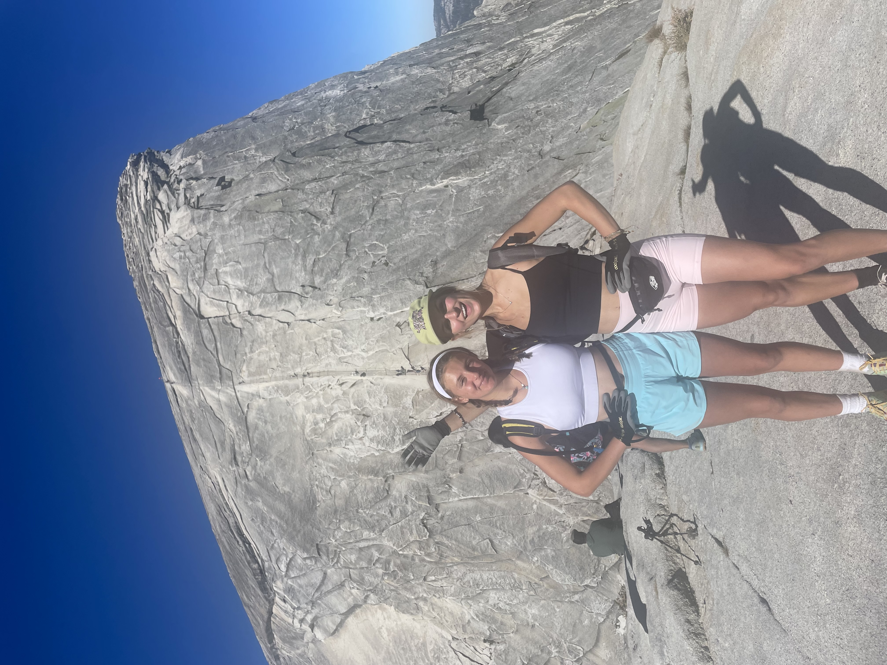
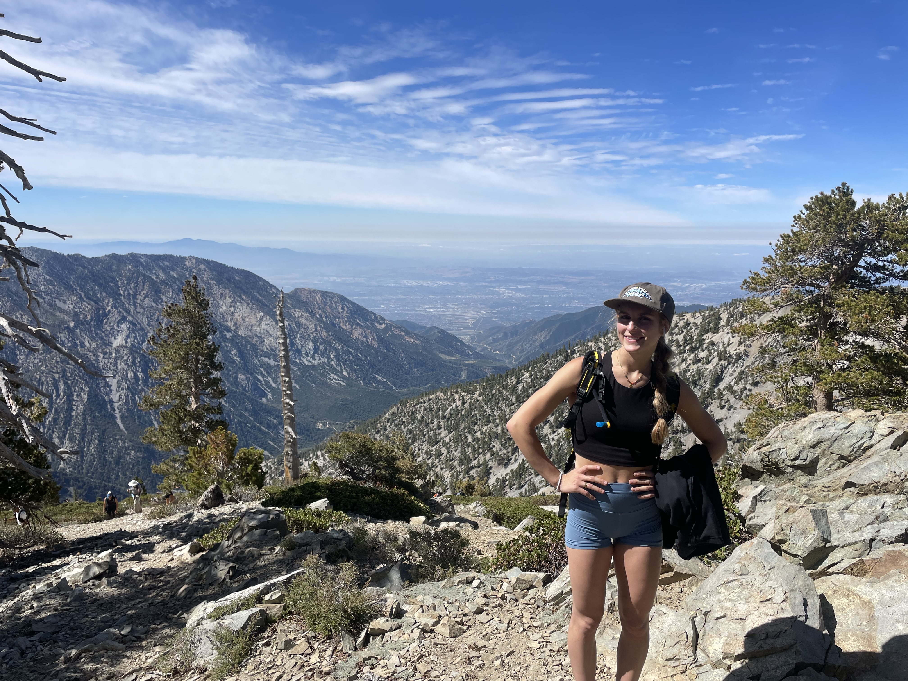

# Why I love hiking

I love getting outside and hiking whenever I have free time . It’s my favorite way to reset and clear my mind. Being on a trail always reminds me how good it feels to slow down and be surrounded by nature. Here are some of my favorites!

# Mount Langley

My mom and I originally planned to take three days (2 nights) to hike Mount Langley, but once we were out there, we ended up speeding up and down the mountain in just 2 days. It’s one of my favorite memories from laughing at how fast the plan changed, to feeling proud of what we pulled off.

# Half Dome

We started our Half Dome hike at 3 a.m., moving through the dark with headlamps and that mix of nerves and excitement you only get on big adventures. The cables were the most fun part for me, and it was amazing watching people in our group face their fears and push themselves all the way to the top.

# Mount Baldy

This one was only meant to be a training hike for mount Langley but it ended up being one of my favorites. We started the day at the base of the hike in Los Angeles hiked 9 miles and got to take the ski lifts down the rest of the hike.

