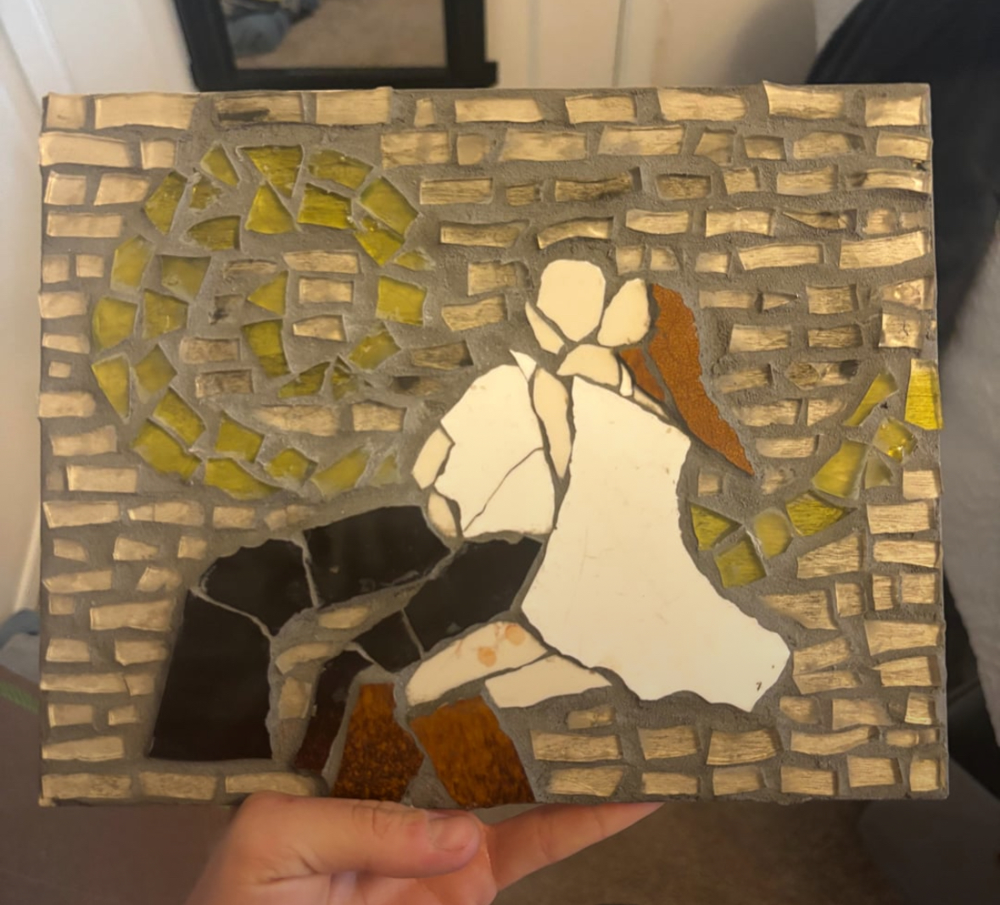
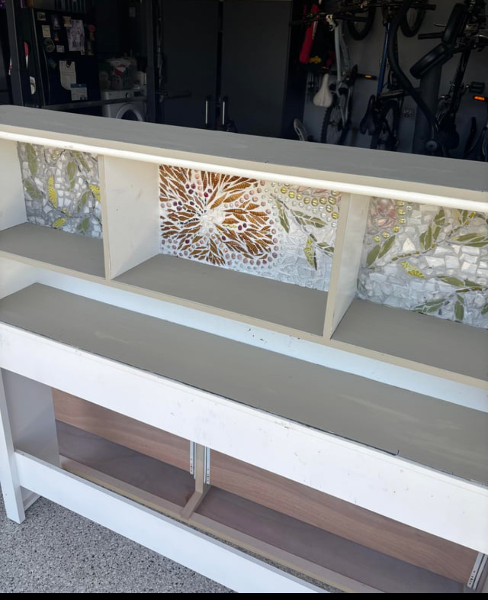
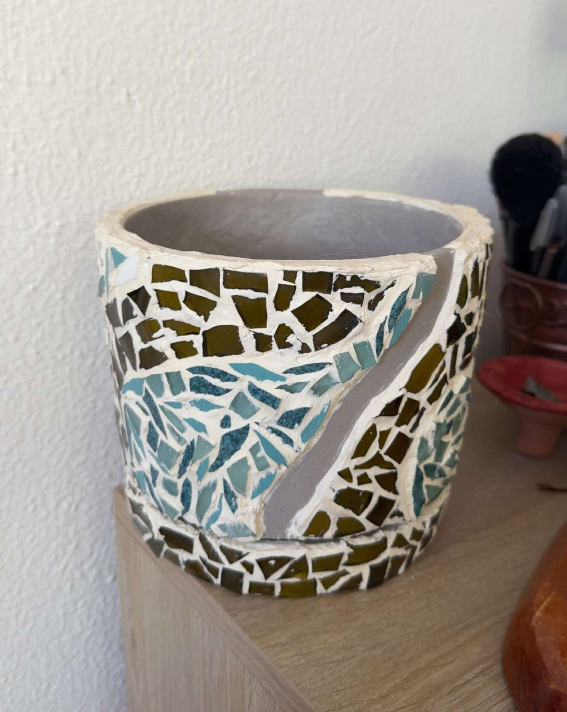

# Mosaic art

I enjoy making mosaic art. Over the years, I’ve experimented with different materials, colors, and patterns, and each project has taught me something new about patience, texture, and design. Here are a few of my past pieces, each one with its own little story and creative process behind it. All materials come form thrifted and recycled glassware that I shape using a scoring and glass cutting method.

## My Favorite Piece

This mosaic depicts a couple based on a reference image. I loved interpreting the connection through my own style and the way I arranged each piece of glass. Creating it was a rewarding process, but giving it as a gift and seeing how much it meant was the best part.

## My Biggest Project Yet

I created a mosaic design on this bedframe, using color and pattern to turn a simple piece of furniture into something expressive and personal. Waking up and seeing it every morning makes me genuinely happy because it’s a reminder of the time and care I put into it.

## My First Project

For my fist ever experience working with glass mosaics, I covered this pot, experimenting with texture and shape to give it a unique, decorative surface. Though this project I learned how to work on curved surfaces and how to use a glass cutter/nipper.

