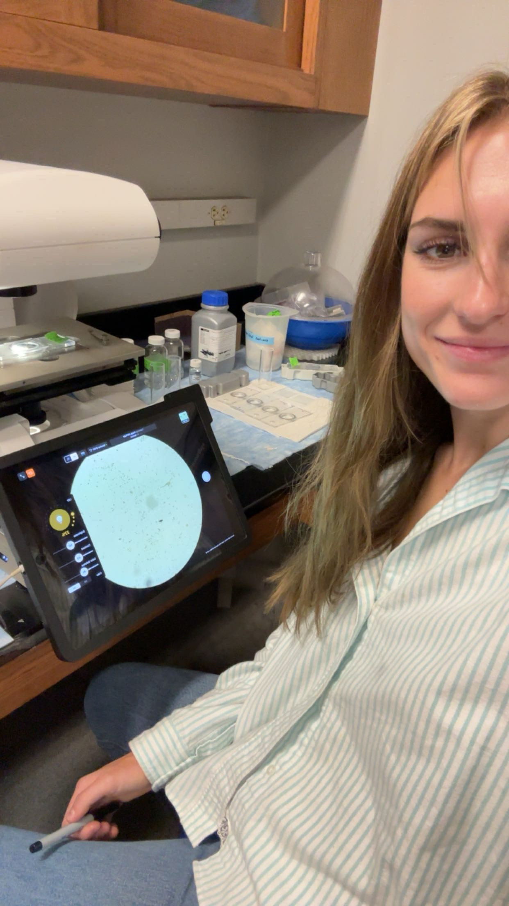

# What is SCCOOS?

The Southern California Coastal Ocean Observing System (SCCOOS) is a regional network that monitors the health of our coastal ocean. They collect data on currents, water quality, plankton, HABs, and more to help scientists and the public understand what’s happening along our coastline in real time. I am a research assistant for SCCOOS!

# What Are HABs?

Harmful Algal Blooms (HABs) occur when certain algae grow rapidly and produce toxins that can affect marine life, ecosystems, and sometimes human health. Not all blooms are harmful, but species like Pseudo‑nitzschia can release domoic acid, which moves through the food web and can impact animals like mussels, seabirds, and sea lions.

# Click to Learn About The HABS I Identify

```{r echo=FALSE}
library(leaflet)
library(htmltools)


ale_icon  <- makeIcon("ale.png",  iconWidth = 40, iconHeight = 40)
psu_icon  <- makeIcon("psu.png",  iconWidth = 40, iconHeight = 40)
cer_icon  <- makeIcon("cer.png",  iconWidth = 40, iconHeight = 40)
dino_icon <- makeIcon("din.png", iconWidth = 40, iconHeight = 40)
aka_icon  <- makeIcon("aka.png",  iconWidth = 40, iconHeight = 40)
ling_icon <- makeIcon("ling.png", iconWidth = 40, iconHeight = 40)
pro_icon <- makeIcon("pro.png", iconWidth = 40, iconHeight = 40)
coc_icon <- makeIcon("coc.png", iconWidth = 40, iconHeight = 40)


leaflet() %>%
  addTiles() %>%

  # ===== 1. Alexandrium =====
  addMarkers(
    lng = -119.8478, lat = 34.4039,
    icon = ale_icon,
    popup = HTML("
      <h3>Alexandrium</h3>
      <p><b>Description:</b> A toxic, marine planktonic dinoflagelate responsable for red tides and the production of saxotoxins. Saxotoxins can cause Paralytic Shellfish Poisoning to humans who consume contaminated shellfish.  </p>
    ")
  ) %>%

  # ===== 2. Pseudo-nitzschia =====
  addMarkers(
    lng = -119.8512, lat = 34.4051,
    icon = psu_icon,
    popup = HTML("
      <h3>Pseudo-nitzschia </h3>
      <p><b>Description:</b> Planktonic diatoms that form chains and cause harmful algal blooms. They produce demoic acid, a neurotoxin that accumulates in shellfish causing amnesic shellfish poisoning in humans and marine life.</p>
    ")
  ) %>%

  # ===== 3. Ceratium =====
  addMarkers(
    lng = -119.8554, lat = 34.4043,
    icon = cer_icon,
    popup = HTML("
      <h3>Ceratium </h3>
      <p><b>Description:</b> Single celled dinoflagellates characterized by their distinctive horns. Their abiltly to create high biomass leads to oxygen depletion and physical damage. </p>
    ")
  ) %>%

  # ===== 4. Dinophysis  =====
  addMarkers(
    lng = -119.8530, lat = 34.4027,
    icon = dino_icon,
    popup = HTML("
      <h3>Dinophysis</h3>
      <p><b>Description:</b> Marnine dinoflagellates that produce okadaic acid. Okadaic acid has been found in deceased birds and mammals. </p>
    ")
  ) %>%

  # ===== 5. Akashiwo sanguinea =====
  addMarkers(
    lng = -119.8589, lat = 34.4062,
    icon = aka_icon,
    popup = HTML("
      <h3>Akashiwo sanguinea</h3>
      <p><b>Description:</b> Marine algae responisble for redtides. They are notorious for releasing a surfactant-like substance during blooms that cause massive seabird mortality. </p>
    ")
  ) %>%


  # ===== 6. Lingulodinium  =====
  addMarkers(
    lng = -119.8507, lat = 34.4069,
    icon = ling_icon,
    popup = HTML("
      <h3>Lingulodinium </h3>
      <p><b>Description:</b> Armored single cell marine dinoflagellate that is responsible for the beautiful (nevertheless harmful) bioluminescence. During the day it causes redtide and can make the water appear a reedish brown hue.</p>
    ")
  ) %>%

  # ===== 7. Prorocentrum =====
  addMarkers(
    lng = -119.8567, lat = 34.4080,
    icon = pro_icon,
    popup = HTML("
      <h3>Prorocentrum</h3>
      <p><b>Description:</b> Marine dinoflagellate found in both planktonic and benthic environments. SOme species are harmless but some produce Okadaic Acid which can cause Diarrhetic Shellfish Poisoning and even their sheer volume can cause harm by blocking sunlight to deeper life.</p>
    ")
  ) %>%

  # ===== 8. Cochlodinium =====
  addMarkers(
    lng = -119.8638, lat = 34.4058,
    icon = coc_icon,
    popup = HTML("
      <h3>Cochlodinium</h3>
      <p><b>Description:</b> Unarmored marine dinoflagellates that pose a threat primarily to marine life. It produces Reactive Oxygen Species and excessive mucas that coats fish gills. </p>
    ")
  )
```

## Me counting Santa Barbara coastal HABS


