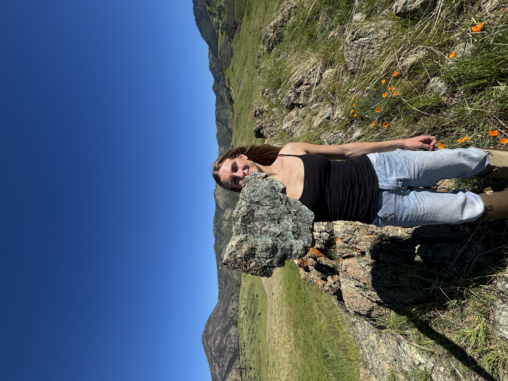

# Serpentine Soils & Plant Indicators

Serpentine soils are some of the harshest environments in California. They are low in essential nutrients, high in heavy metals, and notoriously difficult for plants to thrive in. At Sedgwick Reserve, these extreme soils sit right beside more typical sedimentary units, creating a perfect natural experiment for studying how geology shapes plant communities.

# Can Plants Reveal What’s Beneath the Surface?

During NASA’s SHIFT campaign, researchers measured plant traits across these contrasting geologic units while AVIRIS‑NG collected weekly airborne imagery. Because plants growing on serpentinite often show distinct physiological signatures, their leaves may act as indicators of the soil chemistry below. Building on this work, I’m collecting soil samples from existing SHIFT plots to measure elemental concentrations and directly link them to foliar chemistry. By connecting geology → soils → plant traits, this project tests whether remotely sensed plant trait maps can be used to infer subsurface soil and geochemical properties

# Some fun Field Photos

